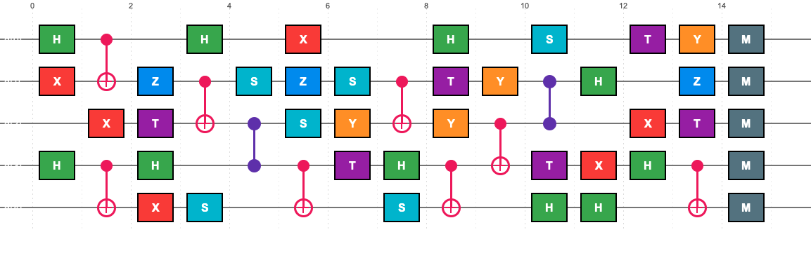
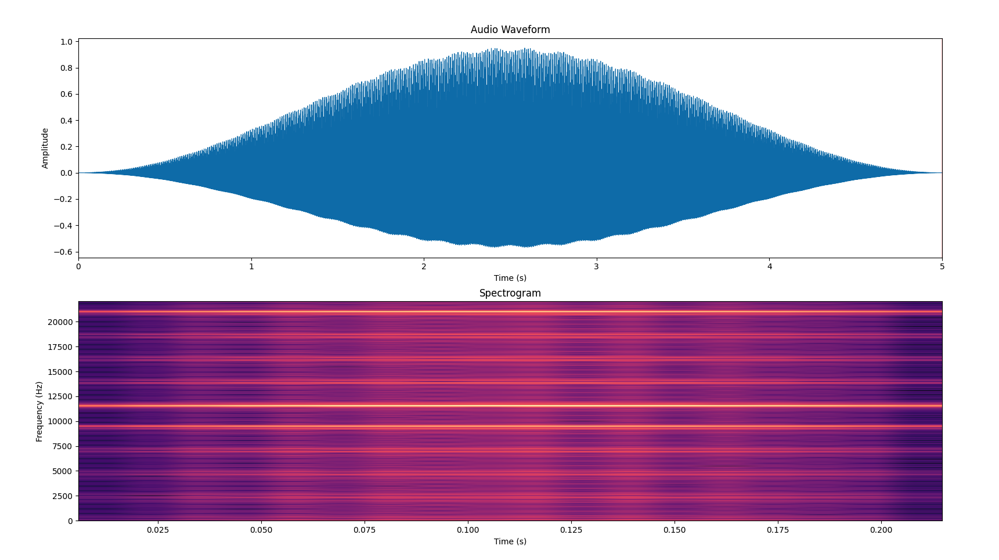

# Q-Wave: Quantum Circuit Audio Generator

**Quantum Circuit-Based Audio Waveform Generator**

Q-Wave is a tool that generates non-classical audio patterns from quantum circuits. It provides both a command-line interface (CUI) and a graphical user interface (GUI) for building quantum circuits and generating audio waveforms that capture quantum interference patterns in sound.

## Overview

This tool implements the core functionality of the Q-Wave project: converting quantum circuit measurements into audio waveforms. The generated audio patterns are designed to exhibit non-classical characteristics that distinguish them from classical noise or random audio generation.

## Features

- **Quantum Circuit Simulation**: Load and execute quantum circuits from QASM files using Qiskit
- **Non-Classical Audio Generation**: Map quantum interference patterns to audio waveforms
- **Spectral Analysis**: Analyze generated audio for quantum-like characteristics
- **Flexible Configuration**: Customizable duration, sample rate, and measurement shots
- **GUI Application**: Visual circuit builder with real-time audio generation, auto-saved WAV files, playback, waveform/spectrum display, and floating spectrogram viewer

## Installation

### Prerequisites

- Python 3.8 or higher
- pip (Python package manager)

### Setup

1. Create a virtual environment (recommended), then install dependencies:

```bash
pip install -r requirements.txt
# Optional: editable install so `import qwave` works without PYTHONPATH
pip install -e .
```

2. Verify installation:

```bash
python qwave_run.py --help
```

## Usage

### GUI Application (Recommended)

For a visual interface to build circuits and generate audio:

```bash
python qwave_gui.py
```



The GUI automatically saves every generated WAV file to a configurable folder (`generated_audio/` by default). Use the **Output Settings** panel to change the destination. When you click **Generate Audio**, the analysis and preview plots update instantly.



During playback a dedicated viewer window opens, showing both waveform and spectrogram with a red cursor that tracks the audio, so you can correlate what you hear with the evolving quantum pattern.

#### GUI Workflow

1. **Select a Gate**: Choose from H, X, Y, Z, T, S, CNOT, CZ, Measurement, or Remove Gate.  
2. **Place or Remove**: Click on the circuit grid; hover previews show exact placement, and clicking the same gate again toggles it off.  
3. **Configure Parameters**: Adjust qubit count, duration (0.5–60s), sample rate (22.05–96 kHz), measurement shots (128–8192), and output folder.  
4. **Generate Audio**: Runs simulation in the background, logs progress, saves WAV automatically, and prints analysis.  
5. **Play / Stop / Save**: Listen immediately, inspect waveform + spectrum, and export circuits or audio files as needed.

Additional tips:
- Use the hover guides and column numbers to see exactly where a gate will land before clicking.
- The “Remove Gate” option or simply re-clicking the same gate/column lets you tidy circuits quickly.
- The log panel records every saved file path, making it easy to locate rendered audio.

#### GUI Usage Details

**Building a Circuit**
- Pick a gate from the left panel (H/X/Y/Z/T/S, CNOT/CZ, Measurement, or Remove).  
- Click the desired qubit line; two-qubit gates automatically target the qubit below the control.  
- Use “Clear Circuit” to reset. Hover highlights and translucent previews show exact placement.

**Generating Audio**
1. Set qubits, duration, sample rate, shots, and auto-save folder.  
2. Press **Generate Audio**. Simulation + audio rendering run asynchronously.  
3. Review spectral metrics (centroid, bandwidth, non-stationarity, modulation depth, quantum likelihood).  
4. Every render drops a timestamped WAV into the chosen folder.

**Playback & Visualization**
- **Play Audio** launches the floating waveform/spectrogram viewer with a real-time cursor.  
- **Stop Audio** halts playback and freezes the cursor at the end.  
- **Save Audio** lets you copy the auto-saved file to any location.

**Circuit Management**
- **Save Circuit** exports the current design to QASM.  
- **Load Circuit** imports QASM (visual reconstruction guidance is shown in the log).  
- Gate selection “Remove” or repeated clicks provide quick edits without clearing the canvas.

**Interface Layout**
- **Left**: Gate list, circuit parameters, audio parameters, output settings, control buttons.  
- **Center**: Scrollable circuit builder with column numbers, hover guides, and previews.  
- **Right**: Status, progress bar, analysis text, combined waveform/spectrum plot.  
- **Bottom**: Log panel with timestamps and file paths.

**Example Workflows**
- *Bell State*: H on q0, CNOT q0→q1, set 3 s/44100 Hz, generate, play, observe entangled spectrum.  
- *Entangled Stack*: H on multiple qubits, layered CNOT/CZ, sprinkle T/S gates, render 10 s @ 48 kHz for evolving textures.

**Troubleshooting**
- Ensure at least one gate is present; two-qubit gates require space below.  
- If Tkinter is unavailable in your venv, run the GUI with system Python or install `python-tk`.  
- Playback issues: verify `pygame` installed, confirm audio file exists (log shows path), and test with an external player if needed.

### Command-Line Interface

For scripted or automated usage:

```bash
python qwave_run.py -c circuits/example_iqp_4q.qasm -o output.wav
```

### Advanced Usage

```bash
python qwave_run.py \
  -c circuits/example_iqp_4q.qasm \
  -o results/q_sound_01.wav \
  -d 10 \
  -s 48000 \
  -shots 4096
```

### Command-Line Arguments

| Argument | Short | Required | Default | Description |
|----------|-------|----------|---------|-------------|
| `--circuit` | `-c` | Yes | - | Path to input QASM circuit file |
| `--output` | `-o` | Yes | - | Path to output WAV file |
| `--duration` | `-d` | No | 5.0 | Audio duration in seconds |
| `--samplerate` | `-s` | No | 44100 | Audio sample rate in Hz |
| `--shots` | - | No | 1024 | Number of quantum measurement shots |
| `--no-analysis` | - | No | False | Skip spectral analysis |

### Examples

**Generate 3-second audio from a simple circuit:**
```bash
python qwave_run.py -c circuits/simple_entangled_3q.qasm -o short_audio.wav -d 3
```

**Generate high-quality audio with more measurements:**
```bash
python qwave_run.py -c circuits/example_iqp_4q.qasm -o hq_audio.wav -d 5 -shots 8192 -s 48000
```

**Generate audio without spectral analysis (faster):**
```bash
python qwave_run.py -c circuits/example_iqp_4q.qasm -o quick_audio.wav --no-analysis
```

## How It Works

### 1. Quantum Circuit Loading
The tool loads quantum circuits from OpenQASM 2.0 format files. These circuits define quantum gates and measurements.

### 2. Quantum Simulation
The loaded circuit is executed on a local quantum simulator (Qiskit Aer). The simulation produces:
- **Measurement results**: Bitstring outcomes and their frequencies
- **Statevector**: Full quantum state including phase information
- **Probability distribution**: Normalized probabilities for each state

### 3. Audio Generation
The quantum measurement data is mapped to audio waveforms using algorithms that:
- Extract interference patterns from quantum phases
- Map quantum states to frequency components
- Apply time-varying modulations based on quantum correlations
- Generate non-stationary audio patterns

### 4. Spectral Analysis
The generated audio is analyzed to detect:
- **Non-stationarity**: Time-varying spectral characteristics
- **Modulation patterns**: Amplitude and frequency modulations
- **Quantum indicators**: Metrics suggesting quantum-like patterns

## Project Structure

```
.
├── qwave/                    # Python package (`import qwave`)
│   ├── modules/              # Simulator, audio generator, analyzer, optimizer
│   ├── gui/                  # Tkinter UI (circuit builder, plots, playback)
│   ├── utils/                # Constants and quantum–audio mapping helpers
│   ├── examples/             # Sample scripts
│   └── scripts/              # Utilities (e.g. verification scripts)
├── qwave_gui.py              # GUI entry point (`python qwave_gui.py`)
├── qwave_run.py              # CLI entry point
├── run_gui.sh                # GUI launcher with venv + PYTHONPATH
├── images/                   # Screenshots for README (optional)
├── requirements.txt
├── pyproject.toml            # Optional: pip install -e .
├── circuits/                 # Sample and reference OpenQASM 2.0 circuits
└── README.md
```

Install in editable mode (sets up imports without manual `PYTHONPATH`):

```bash
pip install -e .
```

## Understanding the Output

### Audio File
The generated WAV file contains audio waveforms that reflect quantum interference patterns. These patterns may exhibit:
- Non-stationary spectral content
- Complex modulation characteristics
- Phase relationships indicative of quantum interference

### Spectral Analysis Report
The analysis report includes:

**Basic Spectral Features:**
- Spectral Centroid: Average frequency (brightness)
- Spectral Bandwidth: Frequency spread
- Spectral Rolloff: Frequency below which 85% of energy is contained
- Spectral Flatness: Measure of noisiness

**Non-Stationarity Analysis:**
- Non-Stationarity Index: Variation of spectral content over time
- Temporal Variation: Normalized variance of spectral features

**Modulation Characteristics:**
- Modulation Depth: Amplitude modulation strength
- Frequency Modulation Index: Frequency variation
- Spectral Spread: Frequency distribution characteristics

**Quantum Pattern Indicators:**
- Spectral Entropy: Complexity measure
- Phase Coherence: Phase relationship consistency
- Periodicity Strength: Regular pattern strength
- Quantum Likelihood Score: Combined quantum indicator

## Creating Custom Circuits

You can create your own QASM circuit files. The circuit should:
- Use OpenQASM 2.0 format
- Include quantum gates that create interference (Hadamard, phase gates)
- Include entanglement (CNOT, CZ gates)
- End with measurement operations

Example minimal circuit:
```qasm
OPENQASM 2.0;
include "qelib1.inc";

qreg q[2];
creg c[2];

h q[0];
cx q[0],q[1];
h q[0];
h q[1];

measure q[0] -> c[0];
measure q[1] -> c[1];
```

## Technical Details

### Quantum-to-Audio Mapping Algorithm

The core algorithm uses the quantum statevector to generate audio:

1. **Frequency Mapping**: Each quantum state maps to a frequency component (logarithmic scale, 20 Hz - 20 kHz)
2. **Amplitude Modulation**: Quantum amplitudes determine component strengths
3. **Phase Modulation**: Quantum phases create interference patterns
4. **Time Modulation**: Non-stationary patterns emerge from quantum correlations

### Limitations

- Circuit size: Optimized for circuits with < 20 qubits
- Simulation time: Larger circuits or more shots increase computation time
- Audio quality: Generated patterns are experimental and may not be musical

## Future Development

This CUI tool serves as the foundation for:
- GUI interface development (planned 2025-2026)
- Advanced quantum audio algorithms
- Real-time quantum audio generation
- Integration with quantum hardware

## License

This project is part of the Q-Wave research initiative.

## Contributing

This is a research tool. For questions or contributions, please refer to the main Q-Wave project documentation.

## References

- Qiskit Documentation: https://qiskit.org/documentation/
- OpenQASM Specification: https://github.com/Qiskit/openqasm
- Librosa Documentation: https://librosa.org/doc/latest/

