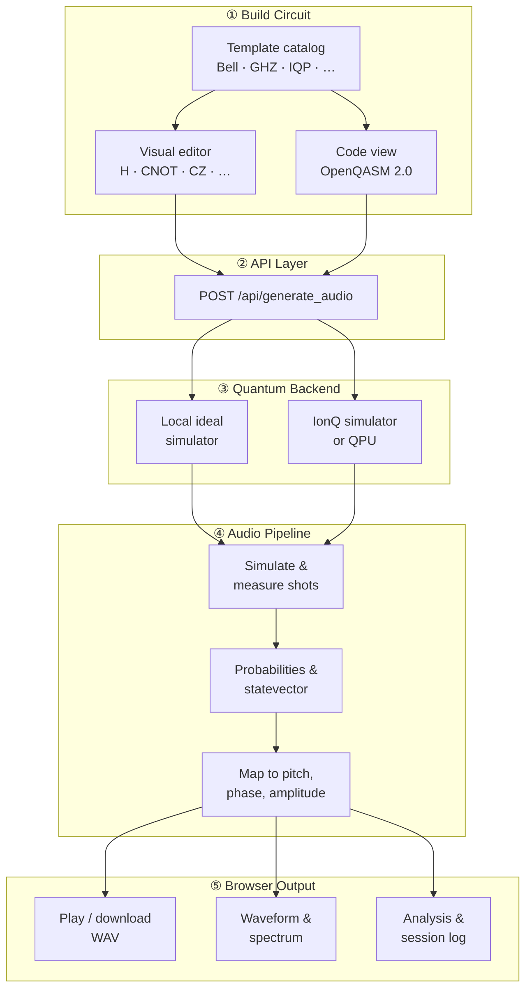

# Musiq

**Quantum Sonic Studio** — compose quantum circuits and render non-classical audio.

OpenQASM or visual circuits → quantum simulation → WAV audio, waveform/spectrum previews, and spectral analysis.

- **Live app:** https://musiquantum.vercel.app/
- **Repo:** https://github.com/dorakingx/musiq

## End-to-End Workflow


```mermaid
flowchart TB
    subgraph Build["① Build Circuit"]
        V[Visual editor<br/>H · CNOT · CZ · …]
        Q[Code view<br/>OpenQASM 2.0]
        T[Template catalog<br/>Bell · GHZ · IQP · …]
    end

    subgraph API["② API Layer"]
        R["POST /api/generate_audio"]
    end

    subgraph Quantum["③ Quantum Backend"]
        direction LR
        L[Local ideal<br/>simulator]
        I[IonQ simulator<br/>or QPU]
    end

    subgraph Pipeline["④ Audio Pipeline"]
        direction LR
        M[Simulate &<br/>measure shots]
        P[Probabilities &<br/>statevector]
        A[Map to pitch,<br/>phase, amplitude]
    end

    subgraph Output["⑤ Browser Output"]
        direction LR
        W[Play / download<br/>WAV]
        S[Waveform &<br/>spectrum]
        N[Analysis &<br/>session log]
    end

    T --> V
    T --> Q
    V --> R
    Q --> R
    R --> L
    R --> I
    L --> M
    I --> M
    M --> P --> A --> W
    A --> S
    A --> N
```

**In the browser:** pick a gate or template → set duration, sample rate, shots, and backend → **Generate audio** → listen, inspect, download.

| Setting | Range |
| --- | --- |
| Visual editor qubits | 2–10 |
| Duration | 0.5–60 s |
| Sample rates | 22,050 / 44,100 / 48,000 / 96,000 Hz |
| Shots | 128–8,192 |

Backends: **Local Ideal Simulator** (default) · **IonQ Simulator** · **IonQ QPU** — requires `IONQ_API_KEY`; falls back to local with a session-log warning if missing.

## Quick Start

```bash
npm install && npm run dev          # UI at http://localhost:3000
npx vercel dev                      # full API (Python serverless) locally
```

```bash
python -m venv .venv && source .venv/bin/activate
pip install -r requirements.txt && pip install -e .
python musiq_run.py -c circuits/example_iqp_4q.qasm -o output.wav   # CLI
```

Set `IONQ_API_KEY` in `.env` (local) or Vercel project settings (production).

## Core Quantum Components

Presentation guide — **show the code**, explain the physics, connect to what you hear.

> **Demo tip:** Load **Example IQP (4Q)**, **Bell State (2Q)**, or **GHZ State (3Q)** from the template catalog, then **Generate audio**.

### 1. Complex Distributions — IQP Circuits

**Code** (`circuits/example_iqp_4q.qasm`, `circuits/iqp_8q.qasm`):

```python
from qiskit import QuantumCircuit

qc = QuantumCircuit(4)
qc.h(range(4))              # superposition
qc.t(0); qc.t(1); qc.z(2); qc.z(3)   # phase injection
qc.cz(0, 1); qc.cz(2, 3); qc.h(range(4))  # entangle + interfere
qc.measure_all()
```

**Quantum:** Hadamard puts qubits in superposition; phase gates twist amplitudes; re-Hadamard causes **constructive/destructive interference** → a spiky probability landscape, not flat noise.

**Musical impact:** Peaks and valleys in the distribution become pitch jumps, accents, and timbral shifts — rich and unpredictable, yet mathematically structured.

### 2. Harmonic Entanglement — Bell & GHZ

**Code** (`circuits/bell_2q.qasm`, `circuits/ghz_3q.qasm`):

```python
# Bell — two voices (|00⟩ + |11⟩)
qc = QuantumCircuit(2); qc.h(0); qc.cx(0, 1); qc.measure_all()

# GHZ — three voices (|000⟩ + |111⟩)
qc = QuantumCircuit(3); qc.h(0); qc.cx(0, 1); qc.cx(1, 2); qc.measure_all()
```

**Quantum:** **Entanglement** correlates measurement outcomes across qubits. IonQ's all-to-all connectivity entangles distant qubits (e.g. Soprano on `q[0]`, Bass on `q[7]`) in one gate.

**Musical impact:** Independent parts move **in sync** — polyphonic harmony instead of disconnected noise streams.

### 3. Probability-to-Audio Mapping

**Code** (`musiq/web/pipeline.py`, `musiq/modules/generator.py`):

```python
# counts → probabilities
probabilities[int(bitstring, 2)] = count / shots

# state index → pitch; amplitude & phase → timbre
freq = self._index_to_musical_frequency(idx)
waveform += amp * np.sin(2 * np.pi * freq * t + phase)
```

**Translation:** The quantum output is the **blueprint** — index → pitch, amplitude → loudness, phase → modulation. This bridges the QPU and the speaker.

## Project Layout

```text
app/          Next.js UI          api/           Vercel Python serverless
musiq/        Quantum + audio core   circuits/   Reference QASM templates
public/       Bundled web templates  musiq_run.py / musiq_gui.py  CLI & desktop GUI
```

## API

| Endpoint | Purpose |
| --- | --- |
| `POST /api/templates` | List / read QASM templates |
| `POST /api/circuit` | Import / export visual circuits as QASM |
| `POST /api/generate_audio` | Simulate → audio + analysis (base64 WAV) |
| `GET /health` | Health check |

## Templates & Build

Reference circuits live in `circuits/`; web copies sync to `public/circuit-templates/` at build time.

**Catalog highlights:** Bell (2Q) · GHZ (3Q) · Example IQP (4Q) · IQP (8Q–56Q) · Hadamard + Measure (8Q) · Ring Entangle (4Q) · Mixed Gates (5Q)

```bash
node scripts/sync-circuit-templates.mjs   # refresh catalog manually
npm run build                             # runs sync automatically
```

## Troubleshooting

| Issue | Fix |
| --- | --- |
| Template 404 | `node scripts/sync-circuit-templates.mjs && npm run dev` |
| IonQ falls back to local | Set `IONQ_API_KEY` in `.env` or Vercel |
| Visual editor disabled | Editor supports ≤10 qubits; use Code view for larger circuits |
| Audio fails in `npm run dev` | Use `vercel dev` or the Python CLI |

## License & Acknowledgments

MIT License.

Supported by the **Quantum Creative Challenge**. Thanks to [Beerantum](https://github.com/Beerantum), especially [Emmanuella Adams](https://github.com/Emmanuella-Adams), for creative support and feedback.
